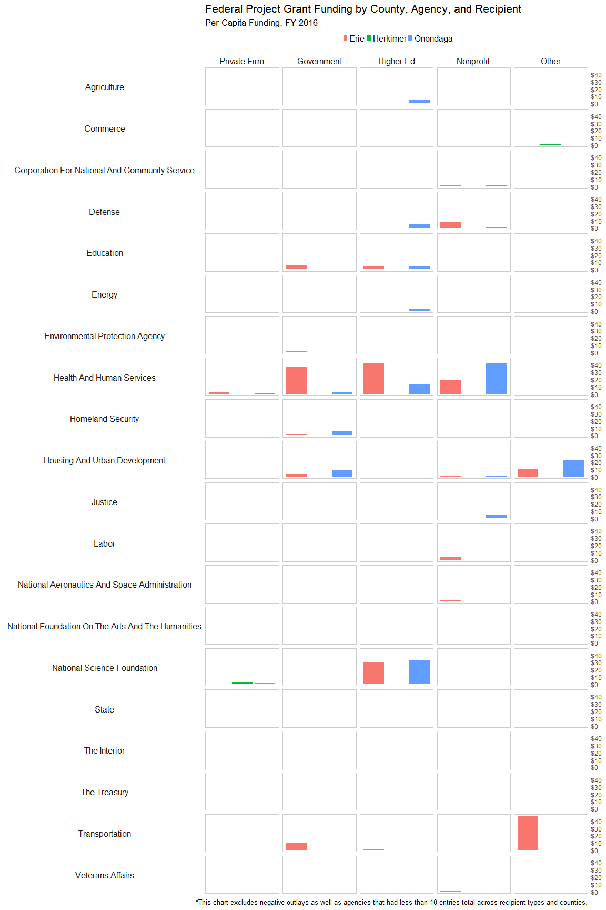

Creating Agency-Recipient Small Multiples Chart
================
Linnea Powell

### 1. Load packages

### 2. Read in grants data and population data

#### bring in grants data and clean for aggregation

``` r
# read in the county grants data
gra16.named <- readRDS(gzcon(url("https://github.com/USAspendingexplorer/USAspending-explorer/blob/master/Data/Processed/NYgra16_counties_named.rds?raw=true")))

# exclude money going to state government and rename county variable as "Name"
gra16.without.state <- filter(gra16.named , recipient_type != "00: State government" )

gra16.2 <- mutate(gra16.without.state, county = as.character(Name))

# select only necessary columns for aggregating project grants by county, agency, and recipient
gra16.3 <- gra16.2[ c("recip_cat_type", "county" , "fed_funding_amount" ,  "maj_agency_cat", "assistance_type" ) ]

# combine similar recipient type categories
x <- gra16.3$recip_cat_type == "i: Private agencies"
gra16.3$recip_cat_type[x] <- "f: Private agencies"

y <- gra16.3$recip_cat_type == "h: Government"
gra16.3$recip_cat_type[y] <- "h: Private agencies"

#making recip_cat_type into a factor and changing the levels into more friendly ones
gra16.3$recip_cat_type <- factor(x= gra16.3$recip_cat_type)

levels(gra16.3$recip_cat_type) <- c("Private Firm",
                                "Government",
                                "Higher Ed",
                                "Nonprofit",
                                "Other")

# clean agency names so that they're consistent when aggregating and easier to read on the chart
simpleCap <- function(x) {
  s <- tolower(x) 
  s <- strsplit(s, " ")[[1]] 
  paste(toupper(substring(s, 1,1)), substring(s, 2), 
  sep="", collapse=" ")
} 
gra16.3$maj_agency_cat <-sapply(gra16.3$maj_agency_cat, simpleCap)

gra16.3$maj_agency_cat<-gsub( "Department Of ", "", as.character(gra16.3$maj_agency_cat), n)

gra16.3$maj_agency_cat<-(substring(gra16.3$maj_agency_cat, 7, nchar(gra16.3$maj_agency_cat)))
```

``` r
# select only project grants
gra16.4<- filter(gra16.3 , assistance_type== "04: Project grant")

# drop rows with negative funding values
gra16.4 <- subset (gra16.4, fed_funding_amount > 0)
```

#### bring in population data

``` r
# read in the population data
population <- readRDS(gzcon(url("https://github.com/USAspendingexplorer/USAspending-explorer/blob/master/Data/Processed/NYcensus.rds?raw=true")))

# select the 2 columns needed - county name and population
pop.dat <- population[ c("county.name", "Pop") ]

# create row for state population
pop.dat.state <- rbind(pop.dat, data.frame(county.name="State Average", Pop=sum(pop.dat$Pop)))
```

### 3. Aggregate Data for Chart

#### aggregate funding by agency and county, and combine with state average

``` r
# aggregate funding by recipient type and agency to find state average
gra16.4$maj_agency_cat<- as.character(gra16.4$maj_agency_cat)

ny.agency.agg <- aggregate (gra16.4$fed_funding_amount, by=list(gra16.4$recip_cat_type, gra16.4$maj_agency_cat), FUN=sum, na.rm=TRUE)

# rename columns after aggregation
colnames(ny.agency.agg)<- c("Recipient_Type", "Agency", "Federal_Funding")

ny.agency.agg["county"] <- "State Average"

colnames(ny.agency.agg)<- c("Recipient_Type", "Agency", "Federal_Funding", "County")

# aggregate by recipient type, agency, and county
county.agency.agg <- aggregate (gra16.4$fed_funding_amount, by=list(gra16.4$recip_cat_type, gra16.4$maj_agency_cat, gra16.4$county), FUN=sum, na.rm=TRUE)

# rename columns after aggregation
colnames(county.agency.agg)<- c("Recipient_Type", "Agency", "County", "Federal_Funding")

# combine county aggregation with state aggregation
agency.agg <- rbind(ny.agency.agg, county.agency.agg)
```

### 4. Merge data

#### merge grants data and population data and adjust to per capita funding

``` r
# merge aggregated grants data with population data by county name
agg.pop <- merge(agency.agg , pop.dat.state, by.x = "County", by.y = "county.name", all.x=TRUE)

# create new variable for per capita funding
agg.pop.percap <- mutate(agg.pop , percap =  Federal_Funding / Pop )

# round percap to be more understandable
agg.pop.percap <- mutate(agg.pop.percap, percap = round(percap, 2))

# drop agencies with less than 10 rows in total
agg.pop.percap<-agg.pop.percap[as.numeric(ave(agg.pop.percap$Agency, agg.pop.percap$Agency, FUN=length)) >= 10, ]
```

### 5. Create county filter

#### create filter for county comparison

``` r
county.filter <- filter(agg.pop.percap, County %in% c("Onondaga", "Erie", "Herkimer"))
```

### 6. Render Chart

#### plot small multiples chart

``` r
ggplot(county.filter, aes(x=County, y= percap)) + geom_bar( aes(fill=County), stat="identity") + scale_y_continuous(position = "right", labels = scales::dollar_format(prefix="$", big.mark = ",")) + facet_grid(Agency ~ Recipient_Type, switch="y")+ labs(title="Federal Project Grant Funding by County, Agency, and Recipient", subtitle="Per Capita Funding, FY 2016", caption = "*This chart excludes negative outlays as well as agencies that had less than 10 entries total across recipient types and counties.") + theme_minimal() + theme (strip.text.y = element_text(size=12, angle = 180), strip.text.x = element_text(size=12), plot.title = element_text(size=16), plot.subtitle = element_text(size=13), legend.position="top", legend.title = element_blank(), axis.title.x=element_blank(), legend.key.size = unit(.5, "line"), legend.text=element_text(size=12), axis.title.y= element_blank(), axis.ticks=element_blank(), axis.text.x= element_blank(), panel.background = element_rect(colour = 'gray80'),panel.grid.minor = element_blank(), panel.grid.major =element_blank())
```


