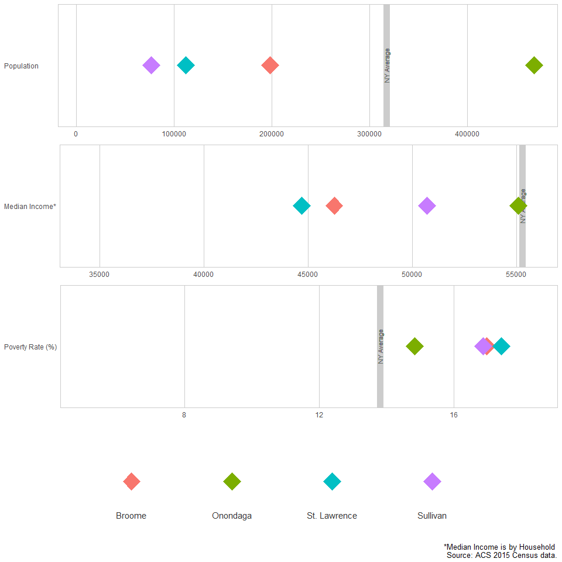

Census comp
================

``` r
################## CALLING THE CENSUS DF #########################

dem <- readRDS( gzcon(url("https://github.com/USAspendingexplorer/USAspending-explorer/blob/master/Data/Processed/NYcensus.rds?raw=true")))

#only working with four comparatos and NY state
#"Matches for Onondaga: 1.Broome, 2.St. Lawrence, 3.Orange, 4.Sullivan, 5.Monroe"

dat <- dem
x <- dat$county.name %in% c("Onondaga", "Broome", "St. Lawrence", "Sullivan")

dat <- dat[x,]
dat$county.name <- factor(dat$county.name, ordered= TRUE)
rownames(dat) <- 1:nrow(dat)
```

Building the function
=====================

``` r
#################### MAKING THE function #######################

#making a df of all the max y min values
maxxes <- data.frame(val= c("Pop", "MHincome", "Pov.rate"), min = c(min(dem$Pop), min(dem$MHincome), min(dem$pov.rate)), max = c(max(dem$Pop), max(dem$MHincome), max(dem$pov.rate)))

maxxes %>% pander
```

<table style="width:35%;">
<colgroup>
<col width="12%" />
<col width="11%" />
<col width="11%" />
</colgroup>
<thead>
<tr class="header">
<th align="center">val</th>
<th align="center">min</th>
<th align="center">max</th>
</tr>
</thead>
<tbody>
<tr class="odd">
<td align="center">Pop</td>
<td align="center">4760</td>
<td align="center">2595259</td>
</tr>
<tr class="even">
<td align="center">MHincome</td>
<td align="center">34299</td>
<td align="center">99465</td>
</tr>
<tr class="odd">
<td align="center">Pov.rate</td>
<td align="center">0.05239</td>
<td align="center">0.2993</td>
</tr>
</tbody>
</table>

``` r
#State Average 317309    55276     13.8

x <- dat

krzycensuz <- function (x)
{
  # Load Required Packages
  require(ggplot2)
  require(gridExtra)
  options(scipen = 999)
  
  #formating poverty rate as a percentage
  x$pov.rate <- x$pov.rate*100
  
  #the function will make three plots, save them into objects and stack them together using gridExtra
  
  #making the first plot
  bar.pop <- ggplot(x, aes(fill=county.name, color = county.name)) +
    geom_vline(xintercept=317309, color = "grey80", size=4, linetype = "solid") +
    geom_text(aes(x=317309, y="Population         ", label= "NY Average"), size = 3, colour = "grey40", angle = 90) +
    geom_point(aes(x=x$Pop, y="Population         "), stat="identity", shape = 23, size = 8) +
    theme_minimal() +
    xlim(4700,max(x$Pop)+1000) + 
    theme(legend.position = "none",
          axis.title = element_blank(),
          panel.background = element_rect(color = "grey80", fill= NA),
          panel.border = element_blank(),
          legend.title = element_blank(),
          panel.grid = element_blank(),
          #panel.grid.major.y = element_line(color = "grey80"),
          #panel.grid.minor.y = element_blank(),
          panel.grid.major.x = element_line(color = "grey80"))
  #panel.grid.minor.x = element_line(color = "grey80"))
  
  #second plot
  bar.inc <- ggplot(x, aes(fill=county.name, color = county.name)) +
    geom_vline(xintercept=55276, color = "grey80", size=4, linetype = "solid") +
    geom_text(aes(x=55276, y="Median Income*", label= "NY Average"), size = 3, colour = "grey40", angle = 90) +
    geom_point(aes(x=x$MHincome, y="Median Income*"), stat="identity", shape = 23, size = 8) +
    theme_minimal() +
    xlim(34200,max(x$MHincome)+800) +
    theme(legend.position = "none",
          axis.title = element_blank(),
          panel.background = element_rect(color = "grey80", fill= NA),
          panel.border = element_blank(),
          legend.title = element_blank(),
          panel.grid = element_blank(),
          #panel.grid.major.y = element_line(color = "grey80"),
          #panel.grid.minor.y = element_blank(),
          panel.grid.major.x = element_line(color = "grey80"))
  #panel.grid.minor.x = element_line(color = "grey80"))
  
  #third plot
  bar.pov <- ggplot(x, aes(fill=county.name, color = county.name)) +
    geom_vline(xintercept=13.8, color = "grey80", size=4, linetype = "solid") +
    geom_text(aes(x=13.8, y="Poverty Rate (%)", label= "NY Average"), size = 3, colour = "grey40", angle = 90) +
    geom_point(aes(x=x$pov.rate, y="Poverty Rate (%)"), stat="identity", shape = 23, size = 8) +
    theme_minimal() +
    xlim(5,max(x$pov.rate)+1) +
    theme(legend.position = "none",
          axis.title = element_blank(),
          panel.background = element_rect(color = "grey80", fill= NA),
          panel.border = element_blank(),
          legend.title = element_blank(),
          panel.grid = element_blank(),
          #panel.grid.major.y = element_line(color = "grey80"),
          #panel.grid.minor.y = element_blank(),
          panel.grid.major.x = element_line(color = "grey80"))
  #panel.grid.minor.x = element_line(color = "grey80"))
  
  
  #making a legend with a plot.
  leg <- ggplot(x, aes(fill=county.name, color = county.name)) +
    geom_point(aes(x=2:(length(levels(x$county.name))+1), y=""), stat="identity", shape = 23, size = 8) +
    theme_minimal() +
    coord_cartesian(xlim = 1:(length(levels(x$county.name))+2)) +
    geom_text(aes(x=2:(length(levels(x$county.name))+1), y=.7, label = paste0(levels(x$county.name))),
              size= 4,
              hjust = .5,
              vjust = .5,
              colour = "grey20") +
    labs(caption = "*Median Income is by Household \n Source: ACS 2015 Census data.") +
    theme(legend.position = "none",
          axis.title = element_blank(),
          axis.text=element_blank(), 
          axis.ticks=element_blank(),
          panel.grid=element_blank(),
          panel.border = element_blank(),
          legend.title = element_blank())
  
  #compiling everything for output
  bars <- grid.arrange(bar.pop, bar.inc, bar.pov, leg, nrow= 4, ncol=1, heights=c(1,1,1,1), widths=c(1))
  
  return(bars)
}

krzycensuz(x)
```



    ## TableGrob (4 x 1) "arrange": 4 grobs
    ##   z     cells    name           grob
    ## 1 1 (1-1,1-1) arrange gtable[layout]
    ## 2 2 (2-2,1-1) arrange gtable[layout]
    ## 3 3 (3-3,1-1) arrange gtable[layout]
    ## 4 4 (4-4,1-1) arrange gtable[layout]

``` r
############################################
```

An alternative that gor discarded: display using a table
========================================================

``` r
#################### MAKING THE table #######################
#install.packages("formattable")
library(formattable)

x <- x[,c("county.name", "Pop", "MHincome", "pov.rate")]
x$Pop <- accounting(x$Pop, digits = 0)
x$MHincome <- accounting(x$MHincome, digits = 0)
x$pov.rate <- percent(x$pov.rate/100, digits = 1)
colnames(x)<- c("County", "Population", "Income", "Poverty Rate")

formattable(x, 
            list(County= formatter("span", style = x ~ ifelse(x == "State Average", style(font.weight = "bold"), style(color = "red"))),
                 Population = color_tile("red", "white"),
                 Income = color_bar("lightblue"),
                 "Poverty Rate" = color_bar("lightblue")))
```

<table class="table table-condensed">
<thead>
<tr>
<th style="text-align:right;">
County
</th>
<th style="text-align:right;">
Population
</th>
<th style="text-align:right;">
Income
</th>
<th style="text-align:right;">
Poverty Rate
</th>
</tr>
</thead>
<tbody>
<tr>
<td style="text-align:right;">
<span style="color: red">Broome </span>
</td>
<td style="text-align:right;">
<span style="display: block; padding: 0 4px; border-radius: 4px; background-color: #ff4f4f">198,093</span>
</td>
<td style="text-align:right;">
<span style="display: inline-block; direction: rtl; border-radius: 4px; padding-right: 2px; background-color: lightblue; width: 83.97%">46,261</span>
</td>
<td style="text-align:right;">
<span style="display: inline-block; direction: rtl; border-radius: 4px; padding-right: 2px; background-color: lightblue; width: 97.50%">0.2%</span>
</td>
</tr>
<tr>
<td style="text-align:right;">
<span style="color: red">Onondaga </span>
</td>
<td style="text-align:right;">
<span style="display: block; padding: 0 4px; border-radius: 4px; background-color: #ffffff">468,304</span>
</td>
<td style="text-align:right;">
<span style="display: inline-block; direction: rtl; border-radius: 4px; padding-right: 2px; background-color: lightblue; width: 100.00%">55,092</span>
</td>
<td style="text-align:right;">
<span style="display: inline-block; direction: rtl; border-radius: 4px; padding-right: 2px; background-color: lightblue; width: 85.26%">0.1%</span>
</td>
</tr>
<tr>
<td style="text-align:right;">
<span style="color: red">St. Lawrence</span>
</td>
<td style="text-align:right;">
<span style="display: block; padding: 0 4px; border-radius: 4px; background-color: #ff1717">112,011</span>
</td>
<td style="text-align:right;">
<span style="display: inline-block; direction: rtl; border-radius: 4px; padding-right: 2px; background-color: lightblue; width: 81.15%">44,705</span>
</td>
<td style="text-align:right;">
<span style="display: inline-block; direction: rtl; border-radius: 4px; padding-right: 2px; background-color: lightblue; width: 100.00%">0.2%</span>
</td>
</tr>
<tr>
<td style="text-align:right;">
<span style="color: red">Sullivan </span>
</td>
<td style="text-align:right;">
<span style="display: block; padding: 0 4px; border-radius: 4px; background-color: #ff0000">76,330</span>
</td>
<td style="text-align:right;">
<span style="display: inline-block; direction: rtl; border-radius: 4px; padding-right: 2px; background-color: lightblue; width: 92.05%">50,710</span>
</td>
<td style="text-align:right;">
<span style="display: inline-block; direction: rtl; border-radius: 4px; padding-right: 2px; background-color: lightblue; width: 96.87%">0.2%</span>
</td>
</tr>
</tbody>
</table>
