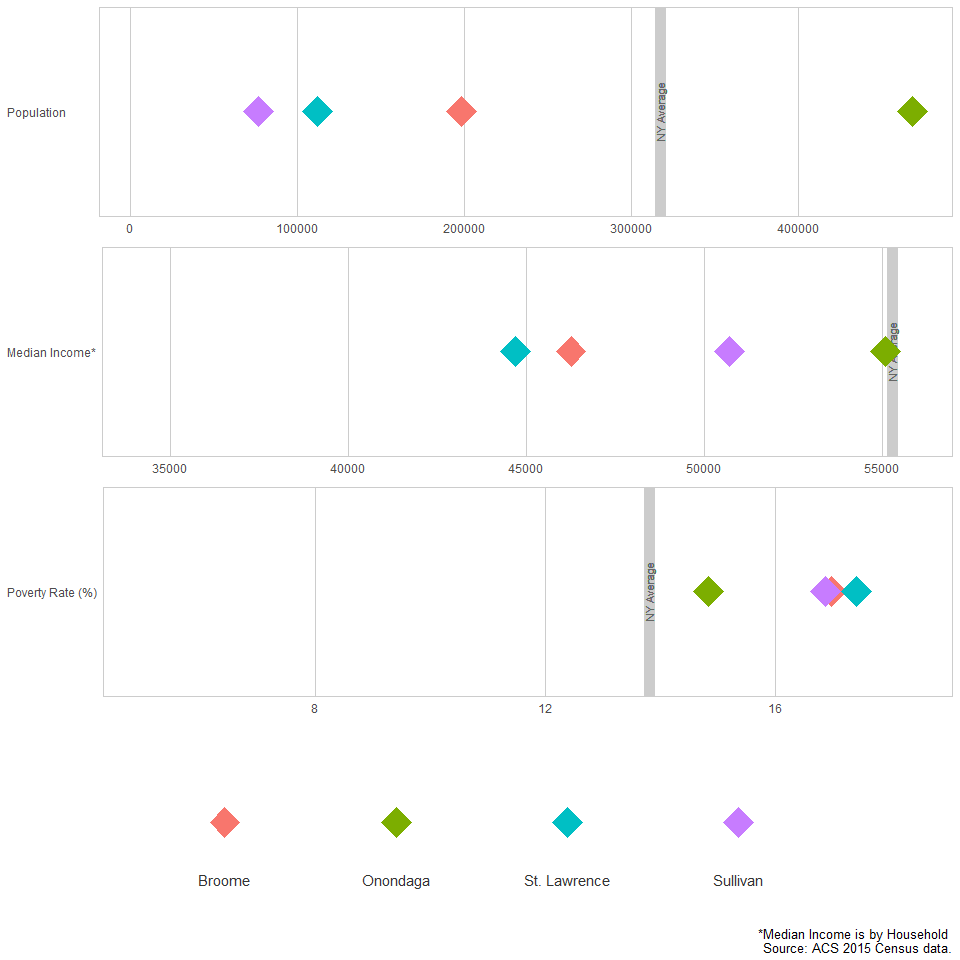

Census comparator build
================

``` r
################## CALLING THE CENSUS DF #########################

dem <- readRDS( gzcon(url("https://github.com/USAspendingexplorer/USAspending-explorer/blob/master/Data/Processed/NYcensus.rds?raw=true")))

#only working with four comparatos and NY state
#"Matches for Onondaga: 1.Broome, 2.St. Lawrence, 3.Orange, 4.Sullivan, 5.Monroe"

dat <- dem
x <- dat$county.name %in% c("Onondaga", "Broome", "St. Lawrence", "Sullivan")

dat <- dat[x,]
dat$county.name <- factor(dat$county.name, ordered= TRUE)
```

Building the function
=====================

``` r
#################### MAKING THE function #######################

#making a df of all the max y min values
maxxes <- data.frame(val= c("Pop", "MHincome", "Pov.rate"), min = c(min(dem$Pop), min(dem$MHincome), min(dem$pov.rate)), max = c(max(dem$Pop), max(dem$MHincome), max(dem$pov.rate)))

maxxes %>% pander
```

<table style="width:35%;">
<colgroup>
<col width="12%" />
<col width="11%" />
<col width="11%" />
</colgroup>
<thead>
<tr class="header">
<th align="center">val</th>
<th align="center">min</th>
<th align="center">max</th>
</tr>
</thead>
<tbody>
<tr class="odd">
<td align="center">Pop</td>
<td align="center">4760</td>
<td align="center">2595259</td>
</tr>
<tr class="even">
<td align="center">MHincome</td>
<td align="center">34299</td>
<td align="center">99465</td>
</tr>
<tr class="odd">
<td align="center">Pov.rate</td>
<td align="center">0.05239</td>
<td align="center">0.2993</td>
</tr>
</tbody>
</table>

``` r
#State Average 317309    55276     13.8

x <- dat

krzycensuz <- function (x)
{
  # Load Required Packages
  require(ggplot2)
  require(gridExtra)
  options(scipen = 999)
  
  #formating poverty rate as a percentage
  x$pov.rate <- x$pov.rate*100
  
  #the function will make three plots, save them into objects and stack them together using gridExtra
  
  #making the first plot
  bar.pop <- ggplot(x, aes(fill=county.name, color = county.name)) +
    geom_vline(xintercept=317309, color = "grey80", size=4, linetype = "solid") +
    geom_text(aes(x=317309, y="Population         ", label= "NY Average"), size = 3, colour = "grey40", angle = 90) +
    geom_point(aes(x=x$Pop, y="Population         "), stat="identity", shape = 23, size = 8) +
    theme_minimal() +
    xlim(4700,max(x$Pop)+1000) + 
    theme(legend.position = "none",
          axis.title = element_blank(),
          panel.background = element_rect(color = "grey80", fill= NA),
          panel.border = element_blank(),
          legend.title = element_blank(),
          panel.grid = element_blank(),
          #panel.grid.major.y = element_line(color = "grey80"),
          #panel.grid.minor.y = element_blank(),
          panel.grid.major.x = element_line(color = "grey80"))
  #panel.grid.minor.x = element_line(color = "grey80"))
  
  #second plot
  bar.inc <- ggplot(x, aes(fill=county.name, color = county.name)) +
    geom_vline(xintercept=55276, color = "grey80", size=4, linetype = "solid") +
    geom_text(aes(x=55276, y="Median Income*", label= "NY Average"), size = 3, colour = "grey40", angle = 90) +
    geom_point(aes(x=x$MHincome, y="Median Income*"), stat="identity", shape = 23, size = 8) +
    theme_minimal() +
    xlim(34200,max(x$MHincome)+800) +
    theme(legend.position = "none",
          axis.title = element_blank(),
          panel.background = element_rect(color = "grey80", fill= NA),
          panel.border = element_blank(),
          legend.title = element_blank(),
          panel.grid = element_blank(),
          #panel.grid.major.y = element_line(color = "grey80"),
          #panel.grid.minor.y = element_blank(),
          panel.grid.major.x = element_line(color = "grey80"))
  #panel.grid.minor.x = element_line(color = "grey80"))
  
  #third plot
  bar.pov <- ggplot(x, aes(fill=county.name, color = county.name)) +
    geom_vline(xintercept=13.8, color = "grey80", size=4, linetype = "solid") +
    geom_text(aes(x=13.8, y="Poverty Rate (%)", label= "NY Average"), size = 3, colour = "grey40", angle = 90) +
    geom_point(aes(x=x$pov.rate, y="Poverty Rate (%)"), stat="identity", shape = 23, size = 8) +
    theme_minimal() +
    xlim(5,max(x$pov.rate)+1) +
    theme(legend.position = "none",
          axis.title = element_blank(),
          panel.background = element_rect(color = "grey80", fill= NA),
          panel.border = element_blank(),
          legend.title = element_blank(),
          panel.grid = element_blank(),
          #panel.grid.major.y = element_line(color = "grey80"),
          #panel.grid.minor.y = element_blank(),
          panel.grid.major.x = element_line(color = "grey80"))
  #panel.grid.minor.x = element_line(color = "grey80"))
  
  
  #making a legend with a plot.
  leg <- ggplot(x, aes(fill=county.name, color = county.name)) +
    geom_point(aes(x=2:(length(levels(x$county.name))+1), y=""), stat="identity", shape = 23, size = 8) +
    theme_minimal() +
    coord_cartesian(xlim = 1:(length(levels(x$county.name))+2)) +
    geom_text(aes(x=2:(length(levels(x$county.name))+1), y=.7, label = paste0(levels(x$county.name))),
              size= 4,
              hjust = .5,
              vjust = .5,
              colour = "grey20") +
    labs(caption = "*Median Income is by Household \n Source: ACS 2015 Census data.") +
    theme(legend.position = "none",
          axis.title = element_blank(),
          axis.text=element_blank(), 
          axis.ticks=element_blank(),
          panel.grid=element_blank(),
          panel.border = element_blank(),
          legend.title = element_blank())
  
  #compiling everything for output
  bars <- grid.arrange(bar.pop, bar.inc, bar.pov, leg, nrow= 4, ncol=1, heights=c(1,1,1,1), widths=c(1))
  
  return(bars)
}

krzycensuz(x)
```


    ## TableGrob (4 x 1) "arrange": 4 grobs
    ##   z     cells    name           grob
    ## 1 1 (1-1,1-1) arrange gtable[layout]
    ## 2 2 (2-2,1-1) arrange gtable[layout]
    ## 3 3 (3-3,1-1) arrange gtable[layout]
    ## 4 4 (4-4,1-1) arrange gtable[layout]

``` r
############################################
```

``` r
population <- readRDS( gzcon(url("https://github.com/USAspendingexplorer/USAspending-explorer/blob/master/Data/Processed/NYcensus.rds?raw=true")))

#################### FILTERING THE DATA #######################
    
    x <- population$county.name %in% c("Onondaga", "Broome", "St. Lawrence", "Sullivan")
    population_plot_filter <- population[x,]
    population_plot_filter$county.name <- factor(population_plot_filter$county.name, ordered= TRUE)
    
    #################### MAKING THE BARPLOT #######################
      
    krzycensuz(population_plot_filter)
```



    ## TableGrob (4 x 1) "arrange": 4 grobs
    ##   z     cells    name           grob
    ## 1 1 (1-1,1-1) arrange gtable[layout]
    ## 2 2 (2-2,1-1) arrange gtable[layout]
    ## 3 3 (3-3,1-1) arrange gtable[layout]
    ## 4 4 (4-4,1-1) arrange gtable[layout]

An alternative that gor discarded: display using a table
========================================================

``` r
#################### MAKING THE table #######################
#install.packages("formattable")
library(formattable)

x <- dem

x <- x[,c("county.name", "Pop", "MHincome", "pov.rate")]
x$Pop <- accounting(x$Pop, digits = 0)
x$MHincome <- accounting(x$MHincome, digits = 0)
x$pov.rate <- percent(x$pov.rate/100, digits = 1)
colnames(x)<- c("County", "Population", "Income", "Poverty Rate")

formattable(x, 
            list(County= formatter("span", style = x ~ ifelse(x == "State Average", style(font.weight = "bold"), style(color = "red"))),
                 Population = color_tile("red", "white"),
                 Income = color_bar("lightblue"),
                 "Poverty Rate" = color_bar("lightblue")))
```

<table class="table table-condensed">
<thead>
<tr>
<th style="text-align:right;">
County
</th>
<th style="text-align:right;">
Population
</th>
<th style="text-align:right;">
Income
</th>
<th style="text-align:right;">
Poverty Rate
</th>
</tr>
</thead>
<tbody>
<tr>
<td style="text-align:right;">
<span style="color: red">Albany </span>
</td>
<td style="text-align:right;">
<span style="display: block; padding: 0 4px; border-radius: 4px; background-color: #ff1d1d">307,463</span>
</td>
<td style="text-align:right;">
<span style="display: inline-block; direction: rtl; border-radius: 4px; padding-right: 2px; background-color: lightblue; width: 60.21%">59,887</span>
</td>
<td style="text-align:right;">
<span style="display: inline-block; direction: rtl; border-radius: 4px; padding-right: 2px; background-color: lightblue; width: 42.75%">0.1%</span>
</td>
</tr>
<tr>
<td style="text-align:right;">
<span style="color: red">Allegany </span>
</td>
<td style="text-align:right;">
<span style="display: block; padding: 0 4px; border-radius: 4px; background-color: #ff0404">48,070</span>
</td>
<td style="text-align:right;">
<span style="display: inline-block; direction: rtl; border-radius: 4px; padding-right: 2px; background-color: lightblue; width: 43.01%">42,776</span>
</td>
<td style="text-align:right;">
<span style="display: inline-block; direction: rtl; border-radius: 4px; padding-right: 2px; background-color: lightblue; width: 50.63%">0.2%</span>
</td>
</tr>
<tr>
<td style="text-align:right;">
<span style="color: red">Bronx </span>
</td>
<td style="text-align:right;">
<span style="display: block; padding: 0 4px; border-radius: 4px; background-color: #ff8c8c">1,428,357</span>
</td>
<td style="text-align:right;">
<span style="display: inline-block; direction: rtl; border-radius: 4px; padding-right: 2px; background-color: lightblue; width: 34.48%">34,299</span>
</td>
<td style="text-align:right;">
<span style="display: inline-block; direction: rtl; border-radius: 4px; padding-right: 2px; background-color: lightblue; width: 100.00%">0.3%</span>
</td>
</tr>
<tr>
<td style="text-align:right;">
<span style="color: red">Broome </span>
</td>
<td style="text-align:right;">
<span style="display: block; padding: 0 4px; border-radius: 4px; background-color: #ff1313">198,093</span>
</td>
<td style="text-align:right;">
<span style="display: inline-block; direction: rtl; border-radius: 4px; padding-right: 2px; background-color: lightblue; width: 46.51%">46,261</span>
</td>
<td style="text-align:right;">
<span style="display: inline-block; direction: rtl; border-radius: 4px; padding-right: 2px; background-color: lightblue; width: 56.69%">0.2%</span>
</td>
</tr>
<tr>
<td style="text-align:right;">
<span style="color: red">Cattaraugus </span>
</td>
<td style="text-align:right;">
<span style="display: block; padding: 0 4px; border-radius: 4px; background-color: #ff0707">78,962</span>
</td>
<td style="text-align:right;">
<span style="display: inline-block; direction: rtl; border-radius: 4px; padding-right: 2px; background-color: lightblue; width: 42.83%">42,601</span>
</td>
<td style="text-align:right;">
<span style="display: inline-block; direction: rtl; border-radius: 4px; padding-right: 2px; background-color: lightblue; width: 59.03%">0.2%</span>
</td>
</tr>
<tr>
<td style="text-align:right;">
<span style="color: red">Cayuga </span>
</td>
<td style="text-align:right;">
<span style="display: block; padding: 0 4px; border-radius: 4px; background-color: #ff0707">79,173</span>
</td>
<td style="text-align:right;">
<span style="display: inline-block; direction: rtl; border-radius: 4px; padding-right: 2px; background-color: lightblue; width: 52.36%">52,082</span>
</td>
<td style="text-align:right;">
<span style="display: inline-block; direction: rtl; border-radius: 4px; padding-right: 2px; background-color: lightblue; width: 38.02%">0.1%</span>
</td>
</tr>
<tr>
<td style="text-align:right;">
<span style="color: red">Chautauqua </span>
</td>
<td style="text-align:right;">
<span style="display: block; padding: 0 4px; border-radius: 4px; background-color: #ff0c0c">132,646</span>
</td>
<td style="text-align:right;">
<span style="display: inline-block; direction: rtl; border-radius: 4px; padding-right: 2px; background-color: lightblue; width: 43.22%">42,993</span>
</td>
<td style="text-align:right;">
<span style="display: inline-block; direction: rtl; border-radius: 4px; padding-right: 2px; background-color: lightblue; width: 60.18%">0.2%</span>
</td>
</tr>
<tr>
<td style="text-align:right;">
<span style="color: red">Chemung </span>
</td>
<td style="text-align:right;">
<span style="display: block; padding: 0 4px; border-radius: 4px; background-color: #ff0808">88,267</span>
</td>
<td style="text-align:right;">
<span style="display: inline-block; direction: rtl; border-radius: 4px; padding-right: 2px; background-color: lightblue; width: 50.59%">50,320</span>
</td>
<td style="text-align:right;">
<span style="display: inline-block; direction: rtl; border-radius: 4px; padding-right: 2px; background-color: lightblue; width: 49.37%">0.1%</span>
</td>
</tr>
<tr>
<td style="text-align:right;">
<span style="color: red">Chenango </span>
</td>
<td style="text-align:right;">
<span style="display: block; padding: 0 4px; border-radius: 4px; background-color: #ff0404">49,549</span>
</td>
<td style="text-align:right;">
<span style="display: inline-block; direction: rtl; border-radius: 4px; padding-right: 2px; background-color: lightblue; width: 45.91%">45,668</span>
</td>
<td style="text-align:right;">
<span style="display: inline-block; direction: rtl; border-radius: 4px; padding-right: 2px; background-color: lightblue; width: 52.19%">0.2%</span>
</td>
</tr>
<tr>
<td style="text-align:right;">
<span style="color: red">Clinton </span>
</td>
<td style="text-align:right;">
<span style="display: block; padding: 0 4px; border-radius: 4px; background-color: #ff0707">81,685</span>
</td>
<td style="text-align:right;">
<span style="display: inline-block; direction: rtl; border-radius: 4px; padding-right: 2px; background-color: lightblue; width: 50.20%">49,930</span>
</td>
<td style="text-align:right;">
<span style="display: inline-block; direction: rtl; border-radius: 4px; padding-right: 2px; background-color: lightblue; width: 49.74%">0.1%</span>
</td>
</tr>
<tr>
<td style="text-align:right;">
<span style="color: red">Columbia </span>
</td>
<td style="text-align:right;">
<span style="display: block; padding: 0 4px; border-radius: 4px; background-color: #ff0505">62,195</span>
</td>
<td style="text-align:right;">
<span style="display: inline-block; direction: rtl; border-radius: 4px; padding-right: 2px; background-color: lightblue; width: 59.42%">59,105</span>
</td>
<td style="text-align:right;">
<span style="display: inline-block; direction: rtl; border-radius: 4px; padding-right: 2px; background-color: lightblue; width: 37.96%">0.1%</span>
</td>
</tr>
<tr>
<td style="text-align:right;">
<span style="color: red">Cortland </span>
</td>
<td style="text-align:right;">
<span style="display: block; padding: 0 4px; border-radius: 4px; background-color: #ff0404">49,043</span>
</td>
<td style="text-align:right;">
<span style="display: inline-block; direction: rtl; border-radius: 4px; padding-right: 2px; background-color: lightblue; width: 49.78%">49,514</span>
</td>
<td style="text-align:right;">
<span style="display: inline-block; direction: rtl; border-radius: 4px; padding-right: 2px; background-color: lightblue; width: 45.47%">0.1%</span>
</td>
</tr>
<tr>
<td style="text-align:right;">
<span style="color: red">Delaware </span>
</td>
<td style="text-align:right;">
<span style="display: block; padding: 0 4px; border-radius: 4px; background-color: #ff0404">46,901</span>
</td>
<td style="text-align:right;">
<span style="display: inline-block; direction: rtl; border-radius: 4px; padding-right: 2px; background-color: lightblue; width: 43.96%">43,720</span>
</td>
<td style="text-align:right;">
<span style="display: inline-block; direction: rtl; border-radius: 4px; padding-right: 2px; background-color: lightblue; width: 48.43%">0.1%</span>
</td>
</tr>
<tr>
<td style="text-align:right;">
<span style="color: red">Dutchess </span>
</td>
<td style="text-align:right;">
<span style="display: block; padding: 0 4px; border-radius: 4px; background-color: #ff1c1c">296,928</span>
</td>
<td style="text-align:right;">
<span style="display: inline-block; direction: rtl; border-radius: 4px; padding-right: 2px; background-color: lightblue; width: 72.29%">71,904</span>
</td>
<td style="text-align:right;">
<span style="display: inline-block; direction: rtl; border-radius: 4px; padding-right: 2px; background-color: lightblue; width: 29.51%">0.1%</span>
</td>
</tr>
<tr>
<td style="text-align:right;">
<span style="color: red">Erie </span>
</td>
<td style="text-align:right;">
<span style="display: block; padding: 0 4px; border-radius: 4px; background-color: #ff5a5a">921,584</span>
</td>
<td style="text-align:right;">
<span style="display: inline-block; direction: rtl; border-radius: 4px; padding-right: 2px; background-color: lightblue; width: 51.52%">51,247</span>
</td>
<td style="text-align:right;">
<span style="display: inline-block; direction: rtl; border-radius: 4px; padding-right: 2px; background-color: lightblue; width: 48.83%">0.1%</span>
</td>
</tr>
<tr>
<td style="text-align:right;">
<span style="color: red">Essex </span>
</td>
<td style="text-align:right;">
<span style="display: block; padding: 0 4px; border-radius: 4px; background-color: #ff0303">38,912</span>
</td>
<td style="text-align:right;">
<span style="display: inline-block; direction: rtl; border-radius: 4px; padding-right: 2px; background-color: lightblue; width: 53.04%">52,758</span>
</td>
<td style="text-align:right;">
<span style="display: inline-block; direction: rtl; border-radius: 4px; padding-right: 2px; background-color: lightblue; width: 33.43%">0.1%</span>
</td>
</tr>
<tr>
<td style="text-align:right;">
<span style="color: red">Franklin </span>
</td>
<td style="text-align:right;">
<span style="display: block; padding: 0 4px; border-radius: 4px; background-color: #ff0404">51,280</span>
</td>
<td style="text-align:right;">
<span style="display: inline-block; direction: rtl; border-radius: 4px; padding-right: 2px; background-color: lightblue; width: 48.18%">47,923</span>
</td>
<td style="text-align:right;">
<span style="display: inline-block; direction: rtl; border-radius: 4px; padding-right: 2px; background-color: lightblue; width: 60.02%">0.2%</span>
</td>
</tr>
<tr>
<td style="text-align:right;">
<span style="color: red">Fulton </span>
</td>
<td style="text-align:right;">
<span style="display: block; padding: 0 4px; border-radius: 4px; background-color: #ff0404">54,606</span>
</td>
<td style="text-align:right;">
<span style="display: inline-block; direction: rtl; border-radius: 4px; padding-right: 2px; background-color: lightblue; width: 47.22%">46,969</span>
</td>
<td style="text-align:right;">
<span style="display: inline-block; direction: rtl; border-radius: 4px; padding-right: 2px; background-color: lightblue; width: 55.67%">0.2%</span>
</td>
</tr>
<tr>
<td style="text-align:right;">
<span style="color: red">Genesee </span>
</td>
<td style="text-align:right;">
<span style="display: block; padding: 0 4px; border-radius: 4px; background-color: #ff0505">59,458</span>
</td>
<td style="text-align:right;">
<span style="display: inline-block; direction: rtl; border-radius: 4px; padding-right: 2px; background-color: lightblue; width: 51.15%">50,880</span>
</td>
<td style="text-align:right;">
<span style="display: inline-block; direction: rtl; border-radius: 4px; padding-right: 2px; background-color: lightblue; width: 43.53%">0.1%</span>
</td>
</tr>
<tr>
<td style="text-align:right;">
<span style="color: red">Greene </span>
</td>
<td style="text-align:right;">
<span style="display: block; padding: 0 4px; border-radius: 4px; background-color: #ff0404">48,312</span>
</td>
<td style="text-align:right;">
<span style="display: inline-block; direction: rtl; border-radius: 4px; padding-right: 2px; background-color: lightblue; width: 50.55%">50,278</span>
</td>
<td style="text-align:right;">
<span style="display: inline-block; direction: rtl; border-radius: 4px; padding-right: 2px; background-color: lightblue; width: 40.19%">0.1%</span>
</td>
</tr>
<tr>
<td style="text-align:right;">
<span style="color: red">Hamilton </span>
</td>
<td style="text-align:right;">
<span style="display: block; padding: 0 4px; border-radius: 4px; background-color: #ff0000">4,760</span>
</td>
<td style="text-align:right;">
<span style="display: inline-block; direction: rtl; border-radius: 4px; padding-right: 2px; background-color: lightblue; width: 48.50%">48,243</span>
</td>
<td style="text-align:right;">
<span style="display: inline-block; direction: rtl; border-radius: 4px; padding-right: 2px; background-color: lightblue; width: 42.74%">0.1%</span>
</td>
</tr>
<tr>
<td style="text-align:right;">
<span style="color: red">Herkimer </span>
</td>
<td style="text-align:right;">
<span style="display: block; padding: 0 4px; border-radius: 4px; background-color: #ff0505">64,034</span>
</td>
<td style="text-align:right;">
<span style="display: inline-block; direction: rtl; border-radius: 4px; padding-right: 2px; background-color: lightblue; width: 46.48%">46,229</span>
</td>
<td style="text-align:right;">
<span style="display: inline-block; direction: rtl; border-radius: 4px; padding-right: 2px; background-color: lightblue; width: 47.71%">0.1%</span>
</td>
</tr>
<tr>
<td style="text-align:right;">
<span style="color: red">Jefferson </span>
</td>
<td style="text-align:right;">
<span style="display: block; padding: 0 4px; border-radius: 4px; background-color: #ff0b0b">118,947</span>
</td>
<td style="text-align:right;">
<span style="display: inline-block; direction: rtl; border-radius: 4px; padding-right: 2px; background-color: lightblue; width: 49.77%">49,505</span>
</td>
<td style="text-align:right;">
<span style="display: inline-block; direction: rtl; border-radius: 4px; padding-right: 2px; background-color: lightblue; width: 47.57%">0.1%</span>
</td>
</tr>
<tr>
<td style="text-align:right;">
<span style="color: red">Kings </span>
</td>
<td style="text-align:right;">
<span style="display: block; padding: 0 4px; border-radius: 4px; background-color: #ffffff">2,595,259</span>
</td>
<td style="text-align:right;">
<span style="display: inline-block; direction: rtl; border-radius: 4px; padding-right: 2px; background-color: lightblue; width: 48.46%">48,201</span>
</td>
<td style="text-align:right;">
<span style="display: inline-block; direction: rtl; border-radius: 4px; padding-right: 2px; background-color: lightblue; width: 76.90%">0.2%</span>
</td>
</tr>
<tr>
<td style="text-align:right;">
<span style="color: red">Lewis </span>
</td>
<td style="text-align:right;">
<span style="display: block; padding: 0 4px; border-radius: 4px; background-color: #ff0202">27,124</span>
</td>
<td style="text-align:right;">
<span style="display: inline-block; direction: rtl; border-radius: 4px; padding-right: 2px; background-color: lightblue; width: 50.09%">49,819</span>
</td>
<td style="text-align:right;">
<span style="display: inline-block; direction: rtl; border-radius: 4px; padding-right: 2px; background-color: lightblue; width: 39.88%">0.1%</span>
</td>
</tr>
<tr>
<td style="text-align:right;">
<span style="color: red">Livingston </span>
</td>
<td style="text-align:right;">
<span style="display: block; padding: 0 4px; border-radius: 4px; background-color: #ff0505">64,801</span>
</td>
<td style="text-align:right;">
<span style="display: inline-block; direction: rtl; border-radius: 4px; padding-right: 2px; background-color: lightblue; width: 52.01%">51,734</span>
</td>
<td style="text-align:right;">
<span style="display: inline-block; direction: rtl; border-radius: 4px; padding-right: 2px; background-color: lightblue; width: 44.75%">0.1%</span>
</td>
</tr>
<tr>
<td style="text-align:right;">
<span style="color: red">Madison </span>
</td>
<td style="text-align:right;">
<span style="display: block; padding: 0 4px; border-radius: 4px; background-color: #ff0606">72,427</span>
</td>
<td style="text-align:right;">
<span style="display: inline-block; direction: rtl; border-radius: 4px; padding-right: 2px; background-color: lightblue; width: 54.44%">54,145</span>
</td>
<td style="text-align:right;">
<span style="display: inline-block; direction: rtl; border-radius: 4px; padding-right: 2px; background-color: lightblue; width: 37.73%">0.1%</span>
</td>
</tr>
<tr>
<td style="text-align:right;">
<span style="color: red">Monroe </span>
</td>
<td style="text-align:right;">
<span style="display: block; padding: 0 4px; border-radius: 4px; background-color: #ff4949">749,356</span>
</td>
<td style="text-align:right;">
<span style="display: inline-block; direction: rtl; border-radius: 4px; padding-right: 2px; background-color: lightblue; width: 52.84%">52,553</span>
</td>
<td style="text-align:right;">
<span style="display: inline-block; direction: rtl; border-radius: 4px; padding-right: 2px; background-color: lightblue; width: 49.12%">0.1%</span>
</td>
</tr>
<tr>
<td style="text-align:right;">
<span style="color: red">Montgomery </span>
</td>
<td style="text-align:right;">
<span style="display: block; padding: 0 4px; border-radius: 4px; background-color: #ff0404">49,779</span>
</td>
<td style="text-align:right;">
<span style="display: inline-block; direction: rtl; border-radius: 4px; padding-right: 2px; background-color: lightblue; width: 44.00%">43,764</span>
</td>
<td style="text-align:right;">
<span style="display: inline-block; direction: rtl; border-radius: 4px; padding-right: 2px; background-color: lightblue; width: 67.46%">0.2%</span>
</td>
</tr>
<tr>
<td style="text-align:right;">
<span style="color: red">Nassau </span>
</td>
<td style="text-align:right;">
<span style="display: block; padding: 0 4px; border-radius: 4px; background-color: #ff8484">1,354,612</span>
</td>
<td style="text-align:right;">
<span style="display: inline-block; direction: rtl; border-radius: 4px; padding-right: 2px; background-color: lightblue; width: 100.00%">99,465</span>
</td>
<td style="text-align:right;">
<span style="display: inline-block; direction: rtl; border-radius: 4px; padding-right: 2px; background-color: lightblue; width: 20.26%">0.1%</span>
</td>
</tr>
<tr>
<td style="text-align:right;">
<span style="color: red">New York </span>
</td>
<td style="text-align:right;">
<span style="display: block; padding: 0 4px; border-radius: 4px; background-color: #ff9f9f">1,629,507</span>
</td>
<td style="text-align:right;">
<span style="display: inline-block; direction: rtl; border-radius: 4px; padding-right: 2px; background-color: lightblue; width: 73.26%">72,871</span>
</td>
<td style="text-align:right;">
<span style="display: inline-block; direction: rtl; border-radius: 4px; padding-right: 2px; background-color: lightblue; width: 58.14%">0.2%</span>
</td>
</tr>
<tr>
<td style="text-align:right;">
<span style="color: red">Niagara </span>
</td>
<td style="text-align:right;">
<span style="display: block; padding: 0 4px; border-radius: 4px; background-color: #ff1414">214,150</span>
</td>
<td style="text-align:right;">
<span style="display: inline-block; direction: rtl; border-radius: 4px; padding-right: 2px; background-color: lightblue; width: 49.71%">49,449</span>
</td>
<td style="text-align:right;">
<span style="display: inline-block; direction: rtl; border-radius: 4px; padding-right: 2px; background-color: lightblue; width: 44.95%">0.1%</span>
</td>
</tr>
<tr>
<td style="text-align:right;">
<span style="color: red">Oneida </span>
</td>
<td style="text-align:right;">
<span style="display: block; padding: 0 4px; border-radius: 4px; background-color: #ff1616">233,558</span>
</td>
<td style="text-align:right;">
<span style="display: inline-block; direction: rtl; border-radius: 4px; padding-right: 2px; background-color: lightblue; width: 48.51%">48,246</span>
</td>
<td style="text-align:right;">
<span style="display: inline-block; direction: rtl; border-radius: 4px; padding-right: 2px; background-color: lightblue; width: 54.01%">0.2%</span>
</td>
</tr>
<tr>
<td style="text-align:right;">
<span style="color: red">Onondaga </span>
</td>
<td style="text-align:right;">
<span style="display: block; padding: 0 4px; border-radius: 4px; background-color: #ff2d2d">468,304</span>
</td>
<td style="text-align:right;">
<span style="display: inline-block; direction: rtl; border-radius: 4px; padding-right: 2px; background-color: lightblue; width: 55.39%">55,092</span>
</td>
<td style="text-align:right;">
<span style="display: inline-block; direction: rtl; border-radius: 4px; padding-right: 2px; background-color: lightblue; width: 49.57%">0.1%</span>
</td>
</tr>
<tr>
<td style="text-align:right;">
<span style="color: red">Ontario </span>
</td>
<td style="text-align:right;">
<span style="display: block; padding: 0 4px; border-radius: 4px; background-color: #ff0a0a">109,192</span>
</td>
<td style="text-align:right;">
<span style="display: inline-block; direction: rtl; border-radius: 4px; padding-right: 2px; background-color: lightblue; width: 57.72%">57,416</span>
</td>
<td style="text-align:right;">
<span style="display: inline-block; direction: rtl; border-radius: 4px; padding-right: 2px; background-color: lightblue; width: 33.58%">0.1%</span>
</td>
</tr>
<tr>
<td style="text-align:right;">
<span style="color: red">Orange </span>
</td>
<td style="text-align:right;">
<span style="display: block; padding: 0 4px; border-radius: 4px; background-color: #ff2424">375,384</span>
</td>
<td style="text-align:right;">
<span style="display: inline-block; direction: rtl; border-radius: 4px; padding-right: 2px; background-color: lightblue; width: 71.23%">70,848</span>
</td>
<td style="text-align:right;">
<span style="display: inline-block; direction: rtl; border-radius: 4px; padding-right: 2px; background-color: lightblue; width: 41.59%">0.1%</span>
</td>
</tr>
<tr>
<td style="text-align:right;">
<span style="color: red">Orleans </span>
</td>
<td style="text-align:right;">
<span style="display: block; padding: 0 4px; border-radius: 4px; background-color: #ff0303">42,204</span>
</td>
<td style="text-align:right;">
<span style="display: inline-block; direction: rtl; border-radius: 4px; padding-right: 2px; background-color: lightblue; width: 46.61%">46,359</span>
</td>
<td style="text-align:right;">
<span style="display: inline-block; direction: rtl; border-radius: 4px; padding-right: 2px; background-color: lightblue; width: 48.86%">0.1%</span>
</td>
</tr>
<tr>
<td style="text-align:right;">
<span style="color: red">Oswego </span>
</td>
<td style="text-align:right;">
<span style="display: block; padding: 0 4px; border-radius: 4px; background-color: #ff0b0b">121,183</span>
</td>
<td style="text-align:right;">
<span style="display: inline-block; direction: rtl; border-radius: 4px; padding-right: 2px; background-color: lightblue; width: 48.12%">47,860</span>
</td>
<td style="text-align:right;">
<span style="display: inline-block; direction: rtl; border-radius: 4px; padding-right: 2px; background-color: lightblue; width: 59.59%">0.2%</span>
</td>
</tr>
<tr>
<td style="text-align:right;">
<span style="color: red">Otsego </span>
</td>
<td style="text-align:right;">
<span style="display: block; padding: 0 4px; border-radius: 4px; background-color: #ff0505">61,399</span>
</td>
<td style="text-align:right;">
<span style="display: inline-block; direction: rtl; border-radius: 4px; padding-right: 2px; background-color: lightblue; width: 48.85%">48,588</span>
</td>
<td style="text-align:right;">
<span style="display: inline-block; direction: rtl; border-radius: 4px; padding-right: 2px; background-color: lightblue; width: 50.46%">0.2%</span>
</td>
</tr>
<tr>
<td style="text-align:right;">
<span style="color: red">Putnam </span>
</td>
<td style="text-align:right;">
<span style="display: block; padding: 0 4px; border-radius: 4px; background-color: #ff0909">99,488</span>
</td>
<td style="text-align:right;">
<span style="display: inline-block; direction: rtl; border-radius: 4px; padding-right: 2px; background-color: lightblue; width: 96.67%">96,148</span>
</td>
<td style="text-align:right;">
<span style="display: inline-block; direction: rtl; border-radius: 4px; padding-right: 2px; background-color: lightblue; width: 17.50%">0.1%</span>
</td>
</tr>
<tr>
<td style="text-align:right;">
<span style="color: red">Queens </span>
</td>
<td style="text-align:right;">
<span style="display: block; padding: 0 4px; border-radius: 4px; background-color: #ffe2e2">2,301,139</span>
</td>
<td style="text-align:right;">
<span style="display: inline-block; direction: rtl; border-radius: 4px; padding-right: 2px; background-color: lightblue; width: 58.03%">57,720</span>
</td>
<td style="text-align:right;">
<span style="display: inline-block; direction: rtl; border-radius: 4px; padding-right: 2px; background-color: lightblue; width: 49.92%">0.1%</span>
</td>
</tr>
<tr>
<td style="text-align:right;">
<span style="color: red">Rensselaer </span>
</td>
<td style="text-align:right;">
<span style="display: block; padding: 0 4px; border-radius: 4px; background-color: #ff0f0f">159,900</span>
</td>
<td style="text-align:right;">
<span style="display: inline-block; direction: rtl; border-radius: 4px; padding-right: 2px; background-color: lightblue; width: 61.04%">60,709</span>
</td>
<td style="text-align:right;">
<span style="display: inline-block; direction: rtl; border-radius: 4px; padding-right: 2px; background-color: lightblue; width: 40.08%">0.1%</span>
</td>
</tr>
<tr>
<td style="text-align:right;">
<span style="color: red">Richmond </span>
</td>
<td style="text-align:right;">
<span style="display: block; padding: 0 4px; border-radius: 4px; background-color: #ff2e2e">472,481</span>
</td>
<td style="text-align:right;">
<span style="display: inline-block; direction: rtl; border-radius: 4px; padding-right: 2px; background-color: lightblue; width: 73.59%">73,197</span>
</td>
<td style="text-align:right;">
<span style="display: inline-block; direction: rtl; border-radius: 4px; padding-right: 2px; background-color: lightblue; width: 41.34%">0.1%</span>
</td>
</tr>
<tr>
<td style="text-align:right;">
<span style="color: red">Rockland </span>
</td>
<td style="text-align:right;">
<span style="display: block; padding: 0 4px; border-radius: 4px; background-color: #ff1f1f">320,688</span>
</td>
<td style="text-align:right;">
<span style="display: inline-block; direction: rtl; border-radius: 4px; padding-right: 2px; background-color: lightblue; width: 85.31%">84,855</span>
</td>
<td style="text-align:right;">
<span style="display: inline-block; direction: rtl; border-radius: 4px; padding-right: 2px; background-color: lightblue; width: 48.04%">0.1%</span>
</td>
</tr>
<tr>
<td style="text-align:right;">
<span style="color: red">St. Lawrence</span>
</td>
<td style="text-align:right;">
<span style="display: block; padding: 0 4px; border-radius: 4px; background-color: #ff0a0a">112,011</span>
</td>
<td style="text-align:right;">
<span style="display: inline-block; direction: rtl; border-radius: 4px; padding-right: 2px; background-color: lightblue; width: 44.95%">44,705</span>
</td>
<td style="text-align:right;">
<span style="display: inline-block; direction: rtl; border-radius: 4px; padding-right: 2px; background-color: lightblue; width: 58.14%">0.2%</span>
</td>
</tr>
<tr>
<td style="text-align:right;">
<span style="color: red">Saratoga </span>
</td>
<td style="text-align:right;">
<span style="display: block; padding: 0 4px; border-radius: 4px; background-color: #ff1515">223,774</span>
</td>
<td style="text-align:right;">
<span style="display: inline-block; direction: rtl; border-radius: 4px; padding-right: 2px; background-color: lightblue; width: 71.88%">71,496</span>
</td>
<td style="text-align:right;">
<span style="display: inline-block; direction: rtl; border-radius: 4px; padding-right: 2px; background-color: lightblue; width: 21.77%">0.1%</span>
</td>
</tr>
<tr>
<td style="text-align:right;">
<span style="color: red">Schenectady </span>
</td>
<td style="text-align:right;">
<span style="display: block; padding: 0 4px; border-radius: 4px; background-color: #ff0e0e">154,796</span>
</td>
<td style="text-align:right;">
<span style="display: inline-block; direction: rtl; border-radius: 4px; padding-right: 2px; background-color: lightblue; width: 58.43%">58,114</span>
</td>
<td style="text-align:right;">
<span style="display: inline-block; direction: rtl; border-radius: 4px; padding-right: 2px; background-color: lightblue; width: 41.06%">0.1%</span>
</td>
</tr>
<tr>
<td style="text-align:right;">
<span style="color: red">Schoharie </span>
</td>
<td style="text-align:right;">
<span style="display: block; padding: 0 4px; border-radius: 4px; background-color: #ff0202">31,913</span>
</td>
<td style="text-align:right;">
<span style="display: inline-block; direction: rtl; border-radius: 4px; padding-right: 2px; background-color: lightblue; width: 51.47%">51,195</span>
</td>
<td style="text-align:right;">
<span style="display: inline-block; direction: rtl; border-radius: 4px; padding-right: 2px; background-color: lightblue; width: 41.20%">0.1%</span>
</td>
</tr>
<tr>
<td style="text-align:right;">
<span style="color: red">Schuyler </span>
</td>
<td style="text-align:right;">
<span style="display: block; padding: 0 4px; border-radius: 4px; background-color: #ff0101">18,410</span>
</td>
<td style="text-align:right;">
<span style="display: inline-block; direction: rtl; border-radius: 4px; padding-right: 2px; background-color: lightblue; width: 47.94%">47,680</span>
</td>
<td style="text-align:right;">
<span style="display: inline-block; direction: rtl; border-radius: 4px; padding-right: 2px; background-color: lightblue; width: 47.09%">0.1%</span>
</td>
</tr>
<tr>
<td style="text-align:right;">
<span style="color: red">Seneca </span>
</td>
<td style="text-align:right;">
<span style="display: block; padding: 0 4px; border-radius: 4px; background-color: #ff0202">35,144</span>
</td>
<td style="text-align:right;">
<span style="display: inline-block; direction: rtl; border-radius: 4px; padding-right: 2px; background-color: lightblue; width: 49.56%">49,292</span>
</td>
<td style="text-align:right;">
<span style="display: inline-block; direction: rtl; border-radius: 4px; padding-right: 2px; background-color: lightblue; width: 38.79%">0.1%</span>
</td>
</tr>
<tr>
<td style="text-align:right;">
<span style="color: red">Steuben </span>
</td>
<td style="text-align:right;">
<span style="display: block; padding: 0 4px; border-radius: 4px; background-color: #ff0909">98,665</span>
</td>
<td style="text-align:right;">
<span style="display: inline-block; direction: rtl; border-radius: 4px; padding-right: 2px; background-color: lightblue; width: 47.53%">47,280</span>
</td>
<td style="text-align:right;">
<span style="display: inline-block; direction: rtl; border-radius: 4px; padding-right: 2px; background-color: lightblue; width: 53.79%">0.2%</span>
</td>
</tr>
<tr>
<td style="text-align:right;">
<span style="color: red">Suffolk </span>
</td>
<td style="text-align:right;">
<span style="display: block; padding: 0 4px; border-radius: 4px; background-color: #ff9393">1,501,373</span>
</td>
<td style="text-align:right;">
<span style="display: inline-block; direction: rtl; border-radius: 4px; padding-right: 2px; background-color: lightblue; width: 89.14%">88,663</span>
</td>
<td style="text-align:right;">
<span style="display: inline-block; direction: rtl; border-radius: 4px; padding-right: 2px; background-color: lightblue; width: 22.98%">0.1%</span>
</td>
</tr>
<tr>
<td style="text-align:right;">
<span style="color: red">Sullivan </span>
</td>
<td style="text-align:right;">
<span style="display: block; padding: 0 4px; border-radius: 4px; background-color: #ff0707">76,330</span>
</td>
<td style="text-align:right;">
<span style="display: inline-block; direction: rtl; border-radius: 4px; padding-right: 2px; background-color: lightblue; width: 50.98%">50,710</span>
</td>
<td style="text-align:right;">
<span style="display: inline-block; direction: rtl; border-radius: 4px; padding-right: 2px; background-color: lightblue; width: 56.32%">0.2%</span>
</td>
</tr>
<tr>
<td style="text-align:right;">
<span style="color: red">Tioga </span>
</td>
<td style="text-align:right;">
<span style="display: block; padding: 0 4px; border-radius: 4px; background-color: #ff0404">50,199</span>
</td>
<td style="text-align:right;">
<span style="display: inline-block; direction: rtl; border-radius: 4px; padding-right: 2px; background-color: lightblue; width: 57.82%">57,514</span>
</td>
<td style="text-align:right;">
<span style="display: inline-block; direction: rtl; border-radius: 4px; padding-right: 2px; background-color: lightblue; width: 31.95%">0.1%</span>
</td>
</tr>
<tr>
<td style="text-align:right;">
<span style="color: red">Tompkins </span>
</td>
<td style="text-align:right;">
<span style="display: block; padding: 0 4px; border-radius: 4px; background-color: #ff0909">103,855</span>
</td>
<td style="text-align:right;">
<span style="display: inline-block; direction: rtl; border-radius: 4px; padding-right: 2px; background-color: lightblue; width: 52.91%">52,624</span>
</td>
<td style="text-align:right;">
<span style="display: inline-block; direction: rtl; border-radius: 4px; padding-right: 2px; background-color: lightblue; width: 59.66%">0.2%</span>
</td>
</tr>
<tr>
<td style="text-align:right;">
<span style="color: red">Ulster </span>
</td>
<td style="text-align:right;">
<span style="display: block; padding: 0 4px; border-radius: 4px; background-color: #ff1111">181,300</span>
</td>
<td style="text-align:right;">
<span style="display: inline-block; direction: rtl; border-radius: 4px; padding-right: 2px; background-color: lightblue; width: 59.23%">58,918</span>
</td>
<td style="text-align:right;">
<span style="display: inline-block; direction: rtl; border-radius: 4px; padding-right: 2px; background-color: lightblue; width: 41.07%">0.1%</span>
</td>
</tr>
<tr>
<td style="text-align:right;">
<span style="color: red">Warren </span>
</td>
<td style="text-align:right;">
<span style="display: block; padding: 0 4px; border-radius: 4px; background-color: #ff0505">65,180</span>
</td>
<td style="text-align:right;">
<span style="display: inline-block; direction: rtl; border-radius: 4px; padding-right: 2px; background-color: lightblue; width: 57.10%">56,798</span>
</td>
<td style="text-align:right;">
<span style="display: inline-block; direction: rtl; border-radius: 4px; padding-right: 2px; background-color: lightblue; width: 39.39%">0.1%</span>
</td>
</tr>
<tr>
<td style="text-align:right;">
<span style="color: red">Washington </span>
</td>
<td style="text-align:right;">
<span style="display: block; padding: 0 4px; border-radius: 4px; background-color: #ff0505">62,700</span>
</td>
<td style="text-align:right;">
<span style="display: inline-block; direction: rtl; border-radius: 4px; padding-right: 2px; background-color: lightblue; width: 51.42%">51,143</span>
</td>
<td style="text-align:right;">
<span style="display: inline-block; direction: rtl; border-radius: 4px; padding-right: 2px; background-color: lightblue; width: 42.64%">0.1%</span>
</td>
</tr>
<tr>
<td style="text-align:right;">
<span style="color: red">Wayne </span>
</td>
<td style="text-align:right;">
<span style="display: block; padding: 0 4px; border-radius: 4px; background-color: #ff0808">92,416</span>
</td>
<td style="text-align:right;">
<span style="display: inline-block; direction: rtl; border-radius: 4px; padding-right: 2px; background-color: lightblue; width: 51.07%">50,798</span>
</td>
<td style="text-align:right;">
<span style="display: inline-block; direction: rtl; border-radius: 4px; padding-right: 2px; background-color: lightblue; width: 41.72%">0.1%</span>
</td>
</tr>
<tr>
<td style="text-align:right;">
<span style="color: red">Westchester </span>
</td>
<td style="text-align:right;">
<span style="display: block; padding: 0 4px; border-radius: 4px; background-color: #ff5e5e">967,315</span>
</td>
<td style="text-align:right;">
<span style="display: inline-block; direction: rtl; border-radius: 4px; padding-right: 2px; background-color: lightblue; width: 84.41%">83,958</span>
</td>
<td style="text-align:right;">
<span style="display: inline-block; direction: rtl; border-radius: 4px; padding-right: 2px; background-color: lightblue; width: 31.34%">0.1%</span>
</td>
</tr>
<tr>
<td style="text-align:right;">
<span style="color: red">Wyoming </span>
</td>
<td style="text-align:right;">
<span style="display: block; padding: 0 4px; border-radius: 4px; background-color: #ff0303">41,446</span>
</td>
<td style="text-align:right;">
<span style="display: inline-block; direction: rtl; border-radius: 4px; padding-right: 2px; background-color: lightblue; width: 52.85%">52,564</span>
</td>
<td style="text-align:right;">
<span style="display: inline-block; direction: rtl; border-radius: 4px; padding-right: 2px; background-color: lightblue; width: 35.67%">0.1%</span>
</td>
</tr>
<tr>
<td style="text-align:right;">
<span style="color: red">Yates </span>
</td>
<td style="text-align:right;">
<span style="display: block; padding: 0 4px; border-radius: 4px; background-color: #ff0202">25,187</span>
</td>
<td style="text-align:right;">
<span style="display: inline-block; direction: rtl; border-radius: 4px; padding-right: 2px; background-color: lightblue; width: 49.78%">49,510</span>
</td>
<td style="text-align:right;">
<span style="display: inline-block; direction: rtl; border-radius: 4px; padding-right: 2px; background-color: lightblue; width: 45.71%">0.1%</span>
</td>
</tr>
</tbody>
</table>
